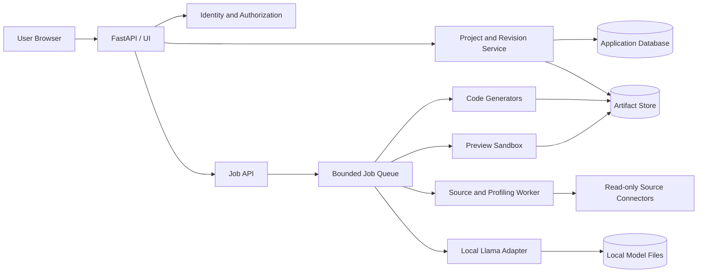

# PAE Architecture Baseline

สถานะ: Approved implementation baseline for Phase 2

## Context

PAE แปลง source sample และ user-confirmed requirements เป็น versioned Pipeline Specification จากนั้นใช้ specification เดียวกันสำหรับ preview, validation และ code generators ทุกภาษา

## Component Boundaries

| Component | Owns | Must not own |
|---|---|---|
| Web/UI | Input, confirmation flow, status presentation | Business semantics or direct source access |
| API | Authentication, authorization, validation, orchestration | Long-running execution |
| Project Service | Projects, immutable revisions, confirmation state | Source credentials |
| Job Service | Queueing, idempotency, progress, cancellation, retry | Transformation semantics |
| Connector | Bounded read-only sampling and source fingerprint | Business rules or writes to source |
| Profiler | Type inference, quality metrics, masked samples, suggestions | User confirmation |
| AI Adapter | Natural language to structured rule proposal | Persisting confirmed specification |
| Specification Service | Schema validation and cross-reference validation | Executing generated code |
| Preview Engine | Shared transformation semantics on bounded samples | Production data processing |
| Code Generator | Deterministic artifacts from a confirmed specification | Guessing missing requirements |
| Sandbox | Resource isolation and validation evidence | Network access by default |
| Artifact Store | Versioned packages and manifests | Raw samples or plaintext secrets |

## Trust Boundaries

1. Browser input is untrusted.
2. Uploaded files and database content are data, never instructions.
3. Local Llama output is untrusted until Pydantic validation and user confirmation.
4. Generated code is untrusted until sandbox validation.
5. Connector network access is allowlisted separately from sandbox network access.
6. Artifact download requires project ownership and revision authorization.

## Source of Truth

- `PipelineSpecification` is the canonical confirmed intent.
- `RevisionIdentity` binds source, schema, specification, generator and model versions.
- Preview and generators consume the same confirmed revision.
- UI suggestions and AI proposals are never authoritative until confirmation creates a new revision.

## Incremental Delivery

The first real vertical slice is CSV → profile → confirm → preview → Python → ZIP. Other sources, transformations and generators extend the same ports and contracts without bypassing confirmation or revision checks.
