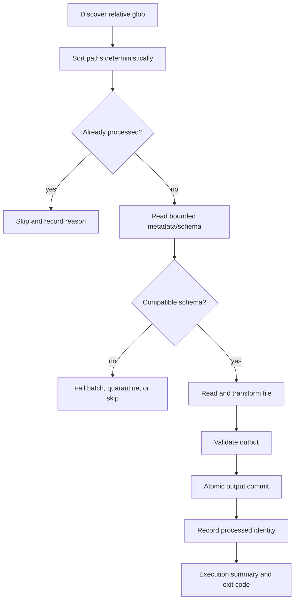

# Reusable Folder Batch Runtime

## Goal

Generated output is a complete runnable pipeline for future files that follow the confirmed source contract. It is not a one-off script tied to the uploaded sample filename.

## Command Contract

```powershell
python src/pipeline.py `
  --input-dir "incoming" `
  --output-dir "processed" `
  --quarantine-dir "quarantine" `
  --state-file ".pae/processed-files.json"
```

Configuration may provide defaults, but runtime paths remain overrideable and no machine-specific absolute path is generated.

## Execution Sequence



## File Identity

The default manifest identity combines normalized relative path, size, modification timestamp and content checksum. Implementations may optimize checksum calculation only when correctness remains equivalent. Renamed or modified content is treated according to explicit policy, never silently assumed processed.

## Schema Compatibility

- `strict`: confirmed columns and compatible types must match; ordering may be ignored for named formats.
- `allow_extra_columns`: required confirmed columns must exist; unselected extra columns are ignored and reported.
- Required and optional columns are separate from nullable values.
- Same extension alone never establishes compatibility.

## Failure Policies

| Policy | Behavior |
|---|---|
| `fail_batch` | Stop before committing later files and return non-zero exit code |
| `quarantine` | Move/copy rejected input and reason metadata to quarantine, continue others |
| `skip` | Leave rejected input in place, record warning and continue |

Default is `quarantine`. Cross-volume moves and failed cleanup must be handled safely without losing the source file.

## Output and Idempotency

- Output uses revision-scoped atomic temporary files.
- State updates occur after successful output commit.
- Re-running unchanged input/state does not create duplicate effective output.
- Batch summary reports discovered, processed, skipped, quarantined, failed and output record counts.

## Scheduling

MVP is scan-on-run. Windows Task Scheduler, cron, CI or an orchestrator may invoke the script periodically. Continuous filesystem watching is deferred and is not embedded in generated code.
