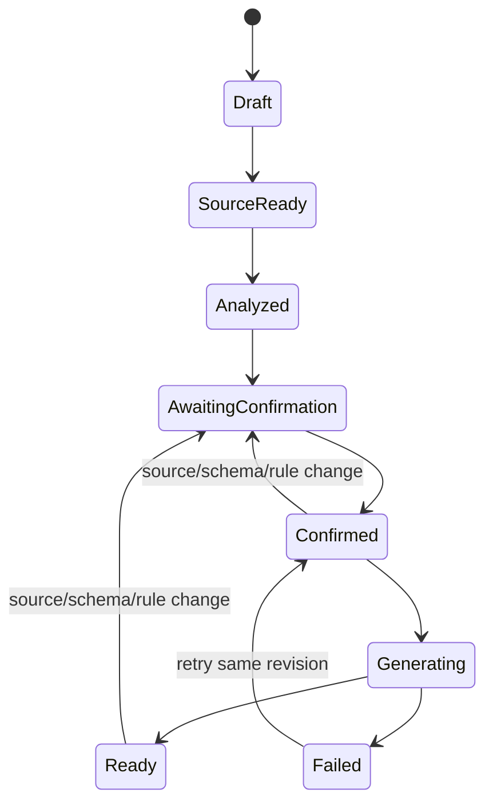

# Pipeline Specification Contract

Canonical implementation: `src/pae/domain/models.py`

Generated JSON Schema: `schemas/pipeline-specification.schema.json`

## Version 1.0

The specification contains:

- immutable specification/project/revision identity;
- SHA-256 source fingerprint;
- one or more discriminated source configurations;
- reusable file-discovery contract for future folder batches, distinct from the uploaded analysis sample;
- inferred and user-confirmed field definitions;
- ordered transformations;
- validation rules and error policy;
- optional join contracts;
- output contract and target runtime;
- confirmation actor and timezone-aware timestamp.

Unknown properties are rejected. Database sources contain `connection_ref` only; passwords and connection URIs are not part of the contract.

## Lifecycle

Any change to source fingerprint, confirmed schema or rules creates a new revision and invalidates preview/validation/artifacts from the previous revision for current-view use. Historical artifacts remain immutable and explicitly labeled.

## Versioning Policy

- `specification_version` uses `major.minor`.
- Minor releases may add optional fields with deterministic defaults.
- Major releases may change semantics or required fields.
- Readers must reject unsupported major versions.
- Migrations create a new representation; they never mutate stored historical JSON.
- Golden fixtures are retained for every supported major version.

## Validation Layers

1. JSON/Pydantic shape validation.
2. Cross-reference validation for sources, fields, joins and rules.
3. Capability validation for language/dialect/output.
4. User confirmation.
5. Preview parity validation.
6. Generator syntax/sample validation.

AI output can enter only layers 1–3 as a proposal. It cannot set confirmation identity or bypass user confirmation.

## Analysis Sample vs Runtime Contract

`FileSource.original_name` records the sample used to infer the contract. `FileSource.runtime` describes how generated code finds future files. Generated code must not hard-code the sample path or filename.

The runtime contract includes input-directory parameter, filename glob, recursive mode, deterministic discovery order, schema compatibility, batch failure policy, processed-file tracking and quarantine/archive parameters.
